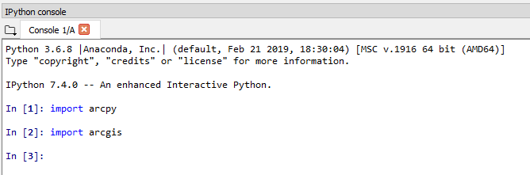

# How to install Spyder using Conda that comes with ArcGIS Pro

This document will give you step by step instructions for installing Spyder and all of its dependencies using the Conda Python package and environment manager that comes with ArcGIS Pro.

## How I did it...

I started this process with a fresh Windows 10 OS with not much else installed except for VS Code. I have a suspicion that having other Conda installations (i.e. Conda that comes with Anaconda) might bungle things up, so it's better to start fresh.

## 1. Install ArcGIS Pro version 1.1 and upgraded fully to 2.4.2

This is pretty self explanatory. Just do it and then we can begin the real fun.

## 2. Clone the base "arcgispro-py3" environment

We're going to execute this from the command line instead of the ArcGIS Pro UI Conda implementation simply because it seems to take MUCH longer that way. It also seems to be more error prone.

The root Conda environment (the one that does the work and won't be modified) exists in `C:\Program Files\ArcGIS\Pro\bin\Python\Scripts`.

Open cmd. Then type and enter: `cd C:\Program Files\ArcGIS\Pro\bin\Python\Scripts`

Type and enter `conda env list` and you should get the following:

```
# conda environments:
#
arcgispro-py3         *  C:\Program Files\ArcGIS\Pro\bin\Python\envs\arcgispro-py3
root                     C:\Program Files\ArcGIS\Pro\bin\Python
```

The asterisk next to the "arcgispro-py3" environment means that this is the base environment which means that if you haven't activated a specific environment, any operations will be performed on the base. The "root" environment on the other hand is the environment we are using to actually do the work and shouldn't be changed (there are exceptions but you should know what you're doing).

Now type and enter: `conda create --name [EnvName] --clone arcgispro-py3`

You can choose anything for `[your env name]`. I chose "dev" (note, I didn't include the brackets). Whatever you put after `--name` will be the name of your new environment.

It should gather and install a load of packages. If it stalls and doesn't seem to be doing anything for a time, BE PATIENT! *It is working*. I got a couple of debug messages during the "arcgis-1.6.1-p" package, but the environment ended up validating as "ok", so I'm in business!

## 3. Activate new env and install spyder

Type and enter: `activate [EnvName]`

Type and enter: `conda install spyder`

It will take a minute for it to fetch the package metadata and specifications, after which it will give you a list of new packages that will be installed and give you the option to proceed. Type "y" and hit enter.

I got a couple more debug messages but hopefully everything will be okay.

## 4. Run Spyder and import arcpy or arcgis packages

Type and enter: `call spyder`

Spyder should launch. Note it should say "Spyder (Python 3.6) on the top banner. Now lets see if it has access to the arcpy and arcgis modules! Go into the Spyder console and type and enter `import arcpy` and `import arcgis`.



If there were no errors then they should have imported fine!

## 5. Create batch script to automatically launch Spyder

Close spyder. Open your favorite text editor and create a file called "Spyder_Pro.bat". Copy the text below into the file and save it. Test it by double clicking on the .bat file and it should launch Spyder. VOILA!

```bat
set root="C:\Program Files\ArcGIS\Pro\bin\Python"
call %root%\Scripts\activate.bat %root%
call activate dev
call spyder
pause
```